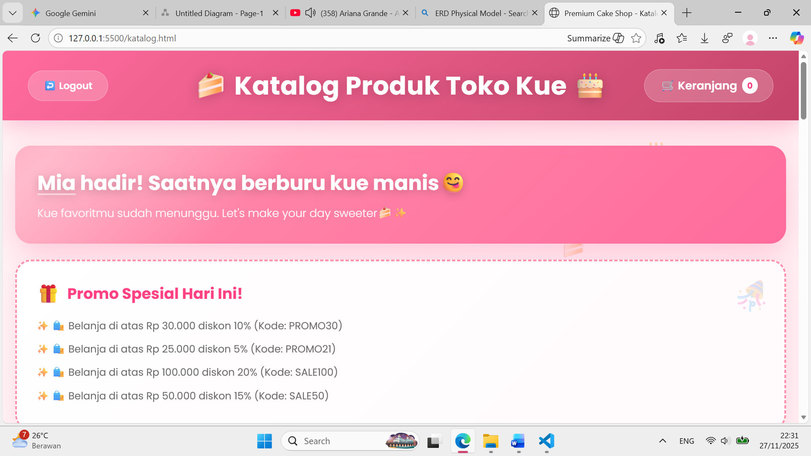
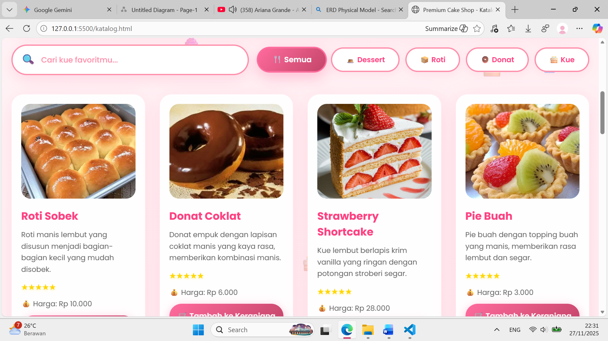

# WEBSITE TOKO KUE🍰

## 1. Nama Project

Website Toko Kue 

## 2. Nama Kelompok & Anggota

Kelompok 4 (Prodi Sistem Informasi)
* Mia Faradila
* M. Daffa Prabaswara
* Daniel Kurniawan

## 3. Deskripsi Singkat Aplikasi

Website toko kue ini menyediakan berbagai pilihan kue, roti, pastry, dan dessert yang dibuat dari bahan berkualitas tinggi dan selalu fresh setiap hari. Dengan tampilan yang simple dan modern, pelanggan dapat dengan mudah menemukan produk favorit mereka, melihat detail setiap menu, melakukan pemesanan, serta menikmati pengalaman belanja yang cepat, aman, dan nyaman. Kami hadir untuk memberikan kue terbaik yang siap menemani setiap momen spesial Anda.

## 4. Tujuan Sistem / Permasalahan yang Diselesaikan

Tujuan utama sistem ini adalah menyediakan platform e-commerce yang efisien untuk penjualan kue secara online, mengatasi batasan penjualan konvensional.

* **Bagi Toko:** Menyediakan sistem manajemen produk (CRUD) dan pesanan yang terpusat melalui Dashboard Admin (di Firestore).
* **Bagi Pelanggan:** Menyediakan akses katalog produk 24/7 dan alur pembelian (checkout) yang cepat dengan fitur diskon voucher.

## 5. Teknologi yang Digunakan (framework, database, bahasa pemrograman)

Aplikasi ini dibangun menggunakan arsitektur **Client-Serverless Model** (N-Tier).

* **Arsitektur:** Single Page Application (SPA) / Client-Serverless Model
* **Bahasa Utama:** JavaScript (ES Modules)
* **Framework/Library:** Firebase SDK (Auth, Firestore)
* **Database:** **Firebase Firestore** (NoSQL Document Database)
* **Manajemen Sesi:** Firebase Authentication Token

## 6. Cara Menjalankan Aplikasi

Aplikasi ini berjalan sebagai aplikasi web statis yang di-deploy menggunakan GitHub Pages.

* **o Cara Instalasi:**
    * **Pilihan 1 (Akses Langsung):** Kunjungi link Deployment (Point 8).
    * **Pilihan 2 (Pengembangan Lokal):** Clone repositori ini ke komputer lokal Anda: `git clone [link-repositori-anda]`.
* **o Cara konfigurasi (jika ada):** Konfigurasi Firebase API Key sudah ada di `js/firebase-config.js`. (Tidak perlu konfigurasi manual).
* **o Cara menjalankan (run project):** Akses URL GitHub Pages atau buka file `index.html` menggunakan Live Server jika dijalankan secara lokal.

## 7. Akun Demo (jika ada login):

Berikut adalah kredensial yang digunakan untuk demonstrasi:

* **o Admin:**
    * username: `admin@gmail.com`
    * password: `123456`
* **o Customer:**
    * username: `mia10@gmail.com`
    * password: `123456`
    * (Pelanggan juga bisa Registrasi Akun Baru melalui toggle di halaman Login).

## 8. Link Deployment / Link APK / Link Demo Video

Link Deployment (via GitHub Pages):
`github.com/mia1014-bit/website-mia/`

## 9. Screenshot Halaman Utama (opsional tapi bagus)

### Halaman 1: Katalog Produk

### Halaman 2: Katalog Produk

## 10. Catatan Tambahan

* **Keterbatasan Sistem:** Keranjang belanja (Cart) saat ini disimpan di **Browser Local Storage**. Data keranjang tidak akan sync antar perangkat dan akan hilang jika cache browser dibersihkan sebelum checkout.
* **Fitur yang sudah selesai:** Implementasi penuh Login/Register dengan otorisasi Role-Based (Admin/Customer), CRUD Produk, dan Logika Diskon Voucher.

## 11. Keterangan tugas

Proyek ini dibuat untuk memenuhi tugas **Final Project mata kuliah Rekayasa Perangkat Lunak (RPL)**.

**Dosen Pengampu:** Dila Nurlaila, M.Kom.
